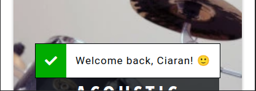
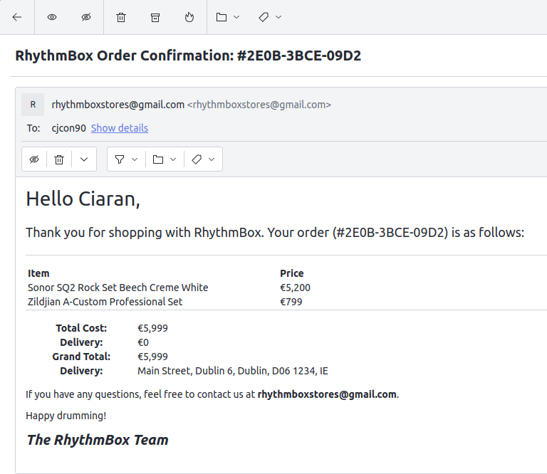

# The RhythmBox - E-Commerce Web App for Professional Drums, Cymbals and Drumming Equipment

Code Institute - Final Milestone Project (4) - Full Stack Frameworks With Django

The RhythmBox is a multi-page e-commerce web application, selling professional drum and percussion equipment.

The application focuses on high quality products from the top and most recogniseable brands in each category: acoustic drums, electronic drums, cymbals and drum hardware & accessories.

**This project contains real products from existing brands, the images of which have all been sourced from [Thomann.de](https://www.thomann.de), a major European music equipment retailer, where all of the actual products can be found.**

This project is hosted on Heroku => [Live Site](https://therhythmbox.herokuapp.com/)

Purchases can be made with the Stripe test credit card:
* **credit card:** 4242 4242 4242 4242
* **expiration date:** Any future date
* **CVC:** Any 3-digit number
* **ZIP:** Any 5-digit number

## Table of Contents

## User Experience

### User Stories

* As a new visitor, I would like:
	+ to see the content and products on offer without having to register
	+ to be able to easily register for the site
	+ to be able to add items to my cart and save them for later
	+ any items in my cart to remain there I have registered for the site
	+ to quickly and easily filter and search for particular items
	+ to be able to sort displayed items by price or user rating
* As a repear visitor, I would like:
	+ to easily login to my existing account
	+ for my previously added cart items to remain selected
	+ to be able to checkout quickly using my previously saved details
	+ to be able to see my order history
	+ to be able to review purchased items, and edit and delete my eviews
* All users would like:
	+ to get feedback when I have completed an action on the site
	+ for the cost and fees involved in an order to be transparent and not confusing in any way
	+ to get a record/confirmation of a successful purchase
	+ for purchases to be completed securely
	+ be able to contact the website owners when necessary

### Wireframes

Desktop and mobile wireframes were designed in Figma, with tablet and mid-sized screens following design cues from both.

[Original Figma Wireframes](https://www.figma.com/file/hg0KWE38FLTnIb9HUORQij/RhythmBox?node-id=0%3A1)

[PDF Wireframes](docs/wireframes.pdf)

#### Changes from wireframes

While the designs of the final website followed the original Figma designs extremely closely, there are a few small changes.

1. Some minor features were left out for the purposes of achieving a minimal viable product, as the core functionality and user stories were met without them. These included:
	+ Sorting and filtering reviews on products and rating product reviews on 'helpfulness'
		- not deemed necessary at this stage as there will be very few reviews on the website
	+ Navigation breadcrumbs on the desktop version of the site
		- although links are structured in a way that this feature could be added in without massive changes 
	+ Saving and storing payment information
		- as currenly, people are only expected to use a test Stripe card
2. The filtering system was changed to single-select list rather than a multi-select, collapsible list as shown in the wireframes. This would have added layers of complexity unnecessary at this stage
3. A star rating system, separate from reviews, was introduced to the product page as people interacting with and testing the site are far more likely to leave a star rating than write a review.

## Information Architecture

As Django works with SQL databases by default, I was using SQLite in development. Heroku, however, provides a PostgreSQL database for deployment.

### Data Models

A full list of data models used on the site are found below.

Unless otherwise stated, the default validation settings of `blank=False, null=False` are assumed.

#### User Model

For this app I created a custom User Model following [this guide in the Django documentation](https://docs.djangoproject.com/en/3.1/topics/auth/customizing/#specifying-a-custom-user-model) and [this tutorial by CodingWithMitch](https://www.youtube.com/watch?v=eCeRC7E8Z7Y).

This made is easy to add custom user fields, and have login based on email as opposed to an unneccessary username being used within model

#### Accounts App

##### `Account` model

| **Name**   | **Database Key**   | **Field Type**   | **Type Validation**   |
| ---------- | ------------------ | ---------------- | --------------------- |
| Email | email | EmailField | max_length=60, unique=True |
| First Name | first_name | CharField | max_length=30 |
| Last Name | last_name | CharField | max_length=30 |
| Newsletter | newsletter | BooleanField | default=True |
| Date Joined | date_joined | DateTimeField | auto_now_add=True |
| Last Login   | last_login | DateTimeField | auto_now_add=True |
| Is Admin | is_admin | BooleanField | default=False |
| Is Active    | is_active        | BooleanField   | default=False              |
| Is Staff     | is_staff         | BooleanField   | default=False              |
| Is Superuser | is_superuser     | BooleanField   | default=False              |

A custom user manager is defined as per [the Django documentation](https://docs.djangoproject.com/en/3.0/topics/auth/customizing/#writing-a-manager-for-a-custom-user-model)

##### `Address` model

| **Name**   | **Database Key**   | **Field Type**   | **Type Validation**   |
| ---------- | ------------------ | ---------------- | --------------------- |
| User | user | OneToOneField 'Account' | on_delete=models.CASCADE |
| Street Address 1 | street_address_1 | CharField | max_length=80 |
| Street Address 2 | street_address_2 | CharField            | max_length=80, null=True, blank=True |
| Town or City     | town_or_city | CharField | max_length=40 |
| County | county | CharField | max_length=40 |
| Postcode         | postcode         | CharField            | max_length=20                        |
| Country          | country          | CountryField         | default="IE"                         |
| Phone Number | phone_number | CharField | max_length=20 |

##### `NewsletterSub` model

| **Name**   | **Database Key**   | **Field Type**   | **Type Validation**   |
| ---------- | ------------------ | ---------------- | --------------------- |
| Email             | email             | EmailField     | max_length=60, unique=True |
| Subscription Date | subscription_date | DateTimeField  | auto_now_add=True          |

#### Products App

##### `Category` model

| **Name**   | **Database Key**   | **Field Type**   | **Type Validation**   |
| ---------- | ------------------ | ---------------- | --------------------- |
| Title    | title            | Charfield      | max_length=255                  |
| Slug     | slug             | Charfield      | max_length=255, blank=True |
| Ordering | order            | IntegerField   | default=0                       |

##### `Subcategory` model

| **Name**   | **Database Key**   | **Field Type**   | **Type Validation**   |
| ---------- | ------------------ | ---------------- | --------------------- |
| Parent   | parent           | OneToOneField 'Category' | on_delete=models.CASCADE        |
| Title    | title            | Charfield                | max_length=255                  |
| Slug     | slug             | Charfield                | max_length=255, blank=True |
| Ordering | order            | IntegerField             | default=0                       |

##### `Type` model

| **Name**   | **Database Key**   | **Field Type**   | **Type Validation**   |
| ---------- | ------------------ | ---------------- | --------------------- |
| Parent   | parent           | OneToOneField 'Subcategory' | on_delete=models.CASCADE        |
| Title    | title            | Charfield                   | max_length=255                  |
| Slug     | slug             | Charfield                   | max_length=255, blank=True |
| Ordering | order            | IntegerField                | default=0                       |

##### `Brand` model

| **Name**   | **Database Key**   | **Field Type**   | **Type Validation**   |
| ---------- | ------------------ | ---------------- | --------------------- |
| Name     | name             | Charfield      | max_length=255                  |
| Slug     | slug             | Charfield      | max_length=255, blank=True |
| Logo     | logo             | ImageField     | upload_to="brands/"             |

##### `Product` model

| **Name**   | **Database Key**   | **Field Type**   | **Type Validation**   |
| ---------- | ------------------ | ---------------- | --------------------- |
| Category    | category         | OneToOneField 'Category'    | on_delete=models.CASCADE                                  |
| Subcategory | subcategory      | OneToOneField 'Subcategory' | on_delete=models.CASCADE                                  |
| Type        | type             | OneToOneField 'Type'        | null=True, blank=True, on_delete=models.CASCADE |
| Title       | title            | Charfield                   | max_length=255                                            |
| Slug        | slug             | Charfield                   | max_length=255, blank=True                           |
| Brand       | brand            | OneToOneField 'Brand'       | null=True, blank=True, on_delete=models.CASCADE |
| Description | description      | TextField                   | blank=True, null=True                                     |
| Price       | price            | DecimalField                | max_digits=7, decimal_places=2                       |
| Stock       | stock            | IntegerField                | default=15                                                |
| Date Added  | date_added       | DateTimeField               | auto_now_add=True                                         |
| Image       | image            | ImageField                  | upload_to="/products/", blank=True, null=True        |
| Thumbnail   | thumbnail        | ImageField                  | upload_to="/products/thumbnails/", blank=True, null=True  |

##### `Rating` model

| **Name**   | **Database Key**   | **Field Type**   | **Type Validation**   |
| ---------- | ------------------ | ---------------- | --------------------- |
| User ID | user_id | OneToOneField 'Account' | on_delete=models.CASCADE |
| Product | product | OneToOneField 'Product' | on_delete=models.CASCADE |
| Rating | rating | IntegerField | choices=Stars.choices |
| Date Added | date_added | DateTimeField | auto_now_add=True |

##### `Review` model

| **Name**   | **Database Key**   | **Field Type**   | **Type Validation**   |
| ---------- | ------------------ | ---------------- | --------------------- |
| Rating | rating | OneToOneField 'Rating' | on_delete=models.CASCADE |
| Headline | headline | CharField | max_length=50 |
| Content | content | TextField | max_length=500 |
| Date Added | date_added | DateTimeField | auto_now_add=True |

##### `Order` model

| **Name**   | **Database Key**   | **Field Type**   | **Type Validation**   |
| ---------- | ------------------ | ---------------- | --------------------- |
| Order Number | order_number | CharField | max_length=32, editable=False, unique=True |
| User | user | ForeignKey 'Account' | on_delete=models.SET_NULL, null=True,  blank=True, related_name='orders' |
| First Name | first_name | CharField | max_length=50 |
| Last Name | last_name | CharField | max_length=50 |
| Street Address 1 | street_address_1 | CharField | max_length=80 |
| Street Address 2 | street_address_2 | CharField | max_length=80, null=True, blank=True |
| Town or City | town_or_city | CharField | max_length=40 |
| County | county | CharField | max_length=40 |
| Postcode | postcode | CharField | max_length=20 |
| Country | country | CountryField | default="IE" |
| Phone Number | phone_number | CharField | max_length=20 |
| Date | date | DateTimeField | auto_now_add=True |
| Delivery Cost | delivery_cost | DecimalField | max_digits=8, decimal_places=2, default=0 |
| Order Total | order_total | DecimalField | max_digits=12,  ecimal_places=2, default=0 |
| Grand Total | grand_total | DecimalField | max_digits=12, decimal_places=2, default=0 |
| Original Cart | original_cart | TextField |  |
| Stripe PID | stripe_pid | CharField | max_length=254 |

##### `OrderLineItem` model

| **Name**        | **Database Key** | **Field Type**       | **Type Validation**                                       |
| --------------- | ---------------- | -------------------- | --------------------------------------------------------- |
| Order           | order            | ForeignKey 'Order'   | on_delete=models.CASCADE, related_name='lineitems'   |
| Product         | product          | ForeignKey 'Product' | on_delete=models.CASCADE                                  |
| Quantity        | quantity         | IntegerField         | default=0                                                 |
| Line Item Total | lineitem_total   | DecimalField         | max_digits=12, decimal_places=2, editable=False |

## Design

### Color Scheme

The app was inspired primarily by two existing websites:
* [Thomann.de](https://www.thomann.de/)
* [John Lewis](https://www.johnlewis.com/)

In the same vein as these two e-commerce websites, the main design of the website would be plain monochrome colors with products being the main feature. This design choice is also why I chose to source white-background product images from thomann.de, for use in RhythmBox

As opposed to these two websites however, I wanted a more striking, large hero image landing page to greet users visiting the website. The landing page design, whereby categories were split into boxes was inspired by [SisuGuard](https://www.sisuguard.com/) (who have since changed their landing page design)

To help create an exciting and engaging landing page and site elements, I chose a bright, brilliant primary colour to help achieve this:

As the background of the website is white throughout, shades of grey were achieved via opacity modificiations on the primary black color

### Typography

I used two fonts throughout the project, both chosen for their legibility and clean, professional appearance

* [Roboto](https://fonts.google.com/specimen/Roboto) - This was the font used throughout the website for paragraph text, form inputs, and general medium weight texts
* [Open Sans Condensed](https://fonts.google.com/specimen/Open+Sans+Condensed?query=open+sans+con) - This font was used for text with both light and heavy weights throughout the website - primarily for headings

### Logo

For the main RhythmBox logo, I purchased an SVG set from [MAKStudion on Etsy](https://www.etsy.com/uk/listing/857133805/drumsticks-svg-drumsticks-dxf-drummer?transaction_id=2424341602)

I then customised the SVG in [Canva](https://www.canva.com/), adding the TRB text to the original drumstick image and colored it in the website's primary yellow colour.

### Icons

[Fontawesome](https://fontawesome.com/) icons were used throughout the website. To enhance website performance, the entire Sass file was downloaded and any unused icons or elements commented out, rather than having to preload the FontAwesome CDN

### Images

As noted, all of the project images were sourced from [https://thomann.de](thomann.de)

Other images used on the landing page were sourced from:
* [Ryan Bruce at Burst](https://burst.shopify.com/photos/microphone-on-snare-drum) - Landing page hero image
* [David Jdt at Unsplash](https://unsplash.com/photos/PlNxD7LalW4) - Acoustic Category image
* [kickstartyourdrumming.com](https://www.kickstartyourdrumming.com/roland-td-1kv-review/) - Electronic Category image
* [Ryan Bruce at Burst](https://burst.shopify.com/photos/ride-cymbal-overhead) - Cymbals Category image
* [Samuel Woods at Unsplash](https://unsplash.com/photos/I6lGrfTB1eU) - Accessories Category image

## Features

### Main

#### Landing Page

- There are clear visible links on the the landing page to the main shop, both in the navigation bar and link within the hero image
- Users can also quickly search within specific categories via the navigation bar or via scrolling through homepage and selecting category of choice

#### Navbar

- The navigation bar is always present at the top of the page so users can access key navigation links no matter where they are on the page
- The RhythmBox logo is visible in the navbar at all times, and serves as a link back to the home page
- The Cart icon serves as a link to the user's current cart and displays how many items are currently in the cart
- If user is logged in, navigation links display:
	- `SHOP` - `ACCOUNT` - `CONTACT US` - `LOGOUT`
- If user is not logged in, navigation links display:
	- `SHOP` - `REGISTER` - `LOGIN` - `CONTACT US`
- Navigation links are compressed into a hamburger menu on mobile and tablet devices so that the main focus of the user is the shopping cart in the top right corner at all times
- On pressing the hamburger button, a full page menu appears to the user with a visually pleasing animation:

#### Footer

- The footer contains an email input for users to sign up to the website newsletter
	- if users are logged in then this is prepopulated with the logged in user's email and set to readonly
-  There are social media buttons linking to facebook, twitter, instagram and whatsapp (would normallly link to a phone number but as it is just a test site it links to whatsapp.com)
-  There is a site navigation section featuring each of the categories of products and their direct subcategories, so users can quickly and easily navigate to the type of product they want
-  There are full contact details listed below with an email address, so users can contact site admin directly from their preferred email application

#### Messages

- Messages flash on screen for all key actions such as logging in / registering / adding items to cart / rating and reviewing products / completing purchases / errors
- SUCCESS, INFO and ERROR messages are used, and these have been tagges with 'check', 'star' and 'time-circle' respectively, to correspond with their icon and color coding within the app:

Success            |  Error |  Star
:-------------------------:|:-------------------------:|:-------------------------:
  |   |  

### Shop

- The main shop page features a grid of up to 9 items per page, with pagination at the bottom to navigate through pages. Each product card displays the product:
	- Image
	- Brand
	- Name
	- Average rating & number of ratings
	- Price
	- Stock levels 
- Users can filter products based on their category, subcategory, type or brand
	- On desktop this filter is fixed on the left of the screen, however on mobile it is hidden off screen and is toggles with a filter button 
- Alternatively, users can search products with a text search, that will  search through the above filters as well as the product title
- The user can sort items based on
	- Most expensive
	- Least Expensive
	- Most recent items
	- Highest rated
- Using the sorting functionality will not undo any existing filter applied on the products shown
- Users can add a single item to the cart from the main shop view, or click into the product page for more actions

### Product Page

#### Product Info
- Product page features all the information from the cards in the shop page as well as two additional features:
	- A detailed item description 
	- A quantitiy selector, to add multiple items to the cart

#### Review Section
- Users can give items a star rating by using the star selector
- Additionally users can leave a written review for a product
	- Reviews are linked to ratings, so if a user has already rated an item then the review form is pre-populated with the previous rating
- If a user has left a review previously then the 'write a review' button is hidden (as a user has no need to write two reviews) and is instead replaced by dual 'edit review' and 'delete review' buttons
	- Deleting a written review will also delete the associated rating

### Cart

- Cart will display a message to the user if empty and prompt them to return to the store to view available items

#### Cart Items
- Cart will display each item in the cart (with multiple of the same item being grouped into one card). The information shown on each cart item card is:
	- Product image
	- Product title
	- Quantity selected
	- Total price of item cost * quantity selected

- User can also update the quantity from within the cart item card and the price will update accordingly
	- If user sets the quantity to 0, the item will be removed from the cart
	- Alternatively, the user can use the 'Remove Item'

#### Cart Summary
- Summary will display whether User qualifies for free delivery based on cost of cart items (currently set at €250)
	- If user does not qualify for free delivery, it will display how much more needs to be spent
	- Otherwise, delivery is calculated at 12.5% of item cost
- Cart will display whether all the items in the cart are currently in stock
	- If a user has previously added an item to the cart and returns later to buy it, but the quantity selected no longer exists in the store, this will display an error message and will also disable the button to proceed to checkout, to prevent errors on purchase
Free Delivery & In Stock            |  No Free Delivery & Out of stock
:-------------------------:|:-------------------------:
  |  

### Checkout

- Checkout screen consists of an order summary and delivery information form

- Delivery name is prepopulated by User details
	- If a user has a saved default address, form is also prepopulated with this
	- If a user is entering an address for the first time, or has changed their address, an option to save address as default is presented within the form
	
- The checkout app uses the Stripe API to manage payments

- On loading the checkout screen, a Stripe payment intent is created. The [Stripe payment intent API](https://stripe.com/docs/payments/payment-intents):

> tracks a payment from creation through checkout, and triggers additional authentication steps when required. Some of the advantages of using the Payment Intents API include:
  - Automatic authentication handling
  - No double charges
  - No idempotency key issues
  - Support for Strong Customer Authentication (SCA) and similar regulatory changes

- A webhook is also implemented within the checkout app, so that the order is successfully processed in case the checkout process gets interrupted; for example - if the user closes the browser window early, or there is an interruption to their internet connection.

- If there are any exceptions in the payment Http request, an error will display stating that *"Sorry, your payment cannot be processes right now. Please try again later"*

#### Checkout Success

- On completion of an order, the user is presented with a screen again summarising their order and displaying their order confirmation number
- A HTML email is also sent to the user with full details of their order
Order Confirmation Email            |
:-------------------------:|
  |

### Account

#### Login / Register

- Login and Register pages each have full form validation with user notified of any errors
- Both pages have a link navigating to each other
- If a User has been redirected to the login page due to a view requiring them to be logged in, they are then redirected back to the **'next'** page they were attempting to access after a successful login
	- If a user enters incorrect details, or navigates to the register page via the login page instead, this **'next'** page is carried along with the request, and they are still redirected back to the appropriate page successful login/registration
- If a User signs up that previously only existed as a Newsletter Subscriber, the NewsLetterSub object is deleted upon creating the new Account object 

> **Note:** For this project I chose to log users in immediately after registration rather than requiring email validation. This is because it is a test/portfolio project, and my aim is to maximise user engagement and make it is as easy as possible for users to quickly test the full flow of the website

#### Account Details

- Account details page is a quick page to view and edit all associated account information.
	- First Name
	- Last Name
	- Email
	- Whether User is Subscribed to the Newsletter
- There is also a separate display where user can add/edit their default address

#### Account Details

- Users can see a complete list of all orders associated with their account. the information shown is:
	- Order date
	- Order Number
	- Total Cost
	- Order Items
	- Image of the most expensive purchase in the order 

#### Password Reset

- Password Rest screen is accessible for both authenticated and anonymous users
- The password reset functionality comes directly from [django.contrib.auth](https://docs.djangoproject.com/en/3.2/ref/contrib/auth/) and consists of 4 stages, each with their own corresponding template
	1. Password Reset form, where user enters their email
	2. Confirmation that email has been sent
	3. Form to select a new password, once users have followed the link sent to them via email
	4. Confirmation that their password has been changed 

Password Reset Email           |
:-------------------------:|
  |

#### Contact Us

- As with other forms in the website, if a user is logged in then the form is prepopulated with the user information 
- Users can send a simple email to the site admin, which will display:
	- User's name
	- User's return email address
	- Email subject
	- Message body