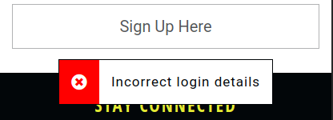
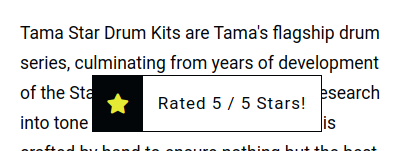
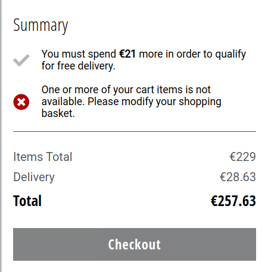

# The RhythmBox - E-Commerce Web App for Professional Drums, Cymbals and Drumming Equipment

Code Institute - Final Milestone Project (4) - Full Stack Frameworks With Django

The RhythmBox is a multi-page e-commerce web application, selling professional drum and percussion equipment.

The application focuses on high quality products from the top and most recogniseable brands in each category: acoustic drums, electronic drums, cymbals and drum hardware & accessories.

**This project contains real products from existing brands, the images of which have all been sourced from [Thomann.de](https://www.thomann.de), a major European music equipment retailer, where all of the actual products can be found.**

This project is hosted on Heroku => [Live Site](https://therhythmbox.herokuapp.com/)

Purchases can be made with the Stripe test credit card:
* **credit card:** 4242 4242 4242 4242
* **expiration date:** Any future date
* **CVC:** Any 3-digit number
* **ZIP:** Any 5-digit number


## Table of Contents

- [The RhythmBox - E-Commerce Web App for Professional Drums, Cymbals and Drumming Equipment](#the-rhythmbox---e-commerce-web-app-for-professional-drums--cymbals-and-drumming-equipment)
  * [Table of Contents](#table-of-contents)
  * [User Experience](#user-experience)
    + [User Stories](#user-stories)
    + [Wireframes](#wireframes)
  * [Information Architecture](#information-architecture)
    + [Data Models](#data-models)
      - [User Model](#user-model)
      - [Accounts App](#accounts-app)
      - [Products App](#products-app)
      - [Checkout App](#checkout-app)
  * [Design](#design)
    + [Color Scheme](#color-scheme)
    + [Typography](#typography)
    + [Logo](#logo)
    + [Icons](#icons)
    + [Images](#images)
  * [Features](#features)
    + [Main](#main)
    + [Shop](#shop)
    + [Product Page](#product-page)
    + [Cart](#cart)
    + [Checkout](#checkout)
    + [Account](#account)
    + [Admin](#admin)
    + [Custom Error Pages](#custom-error-pages)
    + [Features Left to Implement](#features-left-to-implement)
  * [Technologies used.](#technologies-used)
    + [Main Technologies](#main-technologies)
    + [Other tools](#other-tools)
    + [IDE (VSCode) Extensions](#ide--vscode--extensions)
  * [Testing](#testing)
  * [Deployment](#deployment)
  * [Local](#local)
    + [Pre-requisites](#pre-requisites)
    + [Recommended](#recommended)
    + [Steps](#steps)
    + [Heroku Deployment](#heroku-deployment)
  * [Credits](#credits)
    + [Code](#code)
    + [Tutorials](#tutorials)
    + [Acknowledgements](#acknowledgements)

<small><i><a href='http://ecotrust-canada.github.io/markdown-toc/'>Table of contents generated with markdown-toc</a></i></small>


## User Experience

### User Stories

* As a new visitor, I would like:
	+ to see the content and products on offer without having to register
	+ to be able to easily register for the site
	+ to be able to add items to my cart and save them for later
	+ any items in my cart to remain there I have registered for the site
	+ to quickly and easily filter and search for particular items
	+ to be able to sort displayed items by price or user rating
* As a repear visitor, I would like:
	+ to easily login to my existing account
	+ for my previously added cart items to remain selected
	+ to be able to checkout quickly using my previously saved details
	+ to be able to see my order history
	+ to be able to review purchased items, and edit and delete my eviews
* All users would like:
	+ to get feedback when I have completed an action on the site
	+ for the cost and fees involved in an order to be transparent and not confusing in any way
	+ to get a record/confirmation of a successful purchase
	+ for purchases to be completed securely
	+ be able to contact the website owners when necessary

### Wireframes

Desktop and mobile wireframes were designed in Figma, with tablet and mid-sized screens following design cues from both.

[Original Figma Wireframes](https://www.figma.com/file/hg0KWE38FLTnIb9HUORQij/RhythmBox?node-id=0%3A1)

[PDF Wireframes](docs/wireframes.pdf)

#### Changes from Wireframes

While the designs of the final website followed the original Figma designs extremely closely, there are a few small changes.

1. Some minor features were left out for the purposes of achieving a minimal viable product, as the core functionality and user stories were met without them. These included:
	+ Sorting and filtering reviews on products and rating product reviews on 'helpfulness'
		- not deemed necessary at this stage as there will be very few reviews on the website
	+ Navigation breadcrumbs on the desktop version of the site
		- although links are structured in a way that this feature could be added in without massive changes 
	+ Saving and storing payment information
		- as currenly, people are only expected to use a test Stripe card
2. The filtering system was changed to single-select list rather than a multi-select, collapsible list as shown in the wireframes. This would have added layers of complexity unnecessary at this stage
3. A star rating system, separate from reviews, was introduced to the product page as people interacting with and testing the site are far more likely to leave a star rating than write a review.


## Information Architecture

As Django works with SQL databases by default, I was using SQLite in development. Heroku, however, provides a PostgreSQL database for deployment.

### Data Models

A full list of data models used on the site are found below.

Unless otherwise stated, the default validation settings of `blank=False, null=False` are assumed.

#### User Model

For this app I created a custom User Model following [this guide in the Django documentation](https://docs.djangoproject.com/en/3.1/topics/auth/customizing/#specifying-a-custom-user-model) and [this tutorial by CodingWithMitch](https://www.youtube.com/watch?v=eCeRC7E8Z7Y).

This made is easy to add custom user fields, and have login based on email as opposed to an unneccessary username being used within model

#### Accounts App

##### `Account` model

| **Name**   | **Database Key**   | **Field Type**   | **Type Validation**   |
| ---------- | ------------------ | ---------------- | --------------------- |
| Email | email | EmailField | max_length=60, unique=True |
| First Name | first_name | CharField | max_length=30 |
| Last Name | last_name | CharField | max_length=30 |
| Newsletter | newsletter | BooleanField | default=True |
| Date Joined | date_joined | DateTimeField | auto_now_add=True |
| Last Login   | last_login | DateTimeField | auto_now_add=True |
| Is Admin | is_admin | BooleanField | default=False |
| Is Active    | is_active        | BooleanField   | default=False              |
| Is Staff     | is_staff         | BooleanField   | default=False              |
| Is Superuser | is_superuser     | BooleanField   | default=False              |

A custom user manager is defined as per [the Django documentation](https://docs.djangoproject.com/en/3.0/topics/auth/customizing/#writing-a-manager-for-a-custom-user-model)

##### `Address` model

| **Name**   | **Database Key**   | **Field Type**   | **Type Validation**   |
| ---------- | ------------------ | ---------------- | --------------------- |
| User | user | OneToOneField 'Account' | on_delete=models.CASCADE |
| Street Address 1 | street_address_1 | CharField | max_length=80 |
| Street Address 2 | street_address_2 | CharField            | max_length=80, null=True, blank=True |
| Town or City     | town_or_city | CharField | max_length=40 |
| County | county | CharField | max_length=40 |
| Postcode         | postcode         | CharField            | max_length=20                        |
| Country          | country          | CountryField         | default="IE"                         |
| Phone Number | phone_number | CharField | max_length=20 |

##### `NewsletterSub` model

| **Name**   | **Database Key**   | **Field Type**   | **Type Validation**   |
| ---------- | ------------------ | ---------------- | --------------------- |
| Email             | email             | EmailField     | max_length=60, unique=True |
| Subscription Date | subscription_date | DateTimeField  | auto_now_add=True          |

#### Products App

##### `Category` model

| **Name**   | **Database Key**   | **Field Type**   | **Type Validation**   |
| ---------- | ------------------ | ---------------- | --------------------- |
| Title    | title            | Charfield      | max_length=255                  |
| Slug     | slug             | Charfield      | max_length=255,<br />blank=True |
| Ordering | order            | IntegerField   | default=0                       |

##### `Subcategory` model

| **Name**   | **Database Key**   | **Field Type**   | **Type Validation**   |
| ---------- | ------------------ | ---------------- | --------------------- |
| Parent   | parent           | OneToOneField 'Category' | on_delete=models.CASCADE        |
| Title    | title            | Charfield                | max_length=255                  |
| Slug     | slug             | Charfield                | max_length=255,<br />blank=True |
| Ordering | order            | IntegerField             | default=0                       |

##### `Type` model

| **Name**   | **Database Key**   | **Field Type**   | **Type Validation**   |
| ---------- | ------------------ | ---------------- | --------------------- |
| Parent   | parent           | OneToOneField 'Subcategory' | on_delete=models.CASCADE        |
| Title    | title            | Charfield                   | max_length=255                  |
| Slug     | slug             | Charfield                   | max_length=255,<br />blank=True |
| Ordering | order            | IntegerField                | default=0                       |

##### `Brand` model

| **Name**   | **Database Key**   | **Field Type**   | **Type Validation**   |
| ---------- | ------------------ | ---------------- | --------------------- |
| Name     | name             | Charfield      | max_length=255                  |
| Slug     | slug             | Charfield      | max_length=255,<br />blank=True |
| Logo     | logo             | ImageField     | upload_to="brands/"             |

##### `Product` model

| **Name**   | **Database Key**   | **Field Type**   | **Type Validation**   |
| ---------- | ------------------ | ---------------- | --------------------- |
| Category    | category         | OneToOneField 'Category'    | on_delete=models.CASCADE                                  |
| Subcategory | subcategory      | OneToOneField 'Subcategory' | on_delete=models.CASCADE                                  |
| Type        | type             | OneToOneField 'Type'        | null=True,<br />blank=True,<br />on_delete=models.CASCADE |
| Title       | title            | Charfield                   | max_length=255                                            |
| Slug        | slug             | Charfield                   | max_length=255,<br />blank=True                           |
| Brand       | brand            | OneToOneField 'Brand'       | null=True,<br />blank=True,<br />on_delete=models.CASCADE |
| Description | description      | TextField                   | blank=True, null=True                                     |
| Price       | price            | DecimalField                | max_digits=7,<br />decimal_places=2                       |
| Stock       | stock            | IntegerField                | default=15                                                |
| Date Added  | date_added       | DateTimeField               | auto_now_add=True                                         |
| Image       | image            | ImageField                  | upload_to="/products/",<br />blank=True, null=True        |
| Thumbnail   | thumbnail        | ImageField                  | upload_to="/products/thumbnails/", blank=True, null=True  |


##### `Rating` model

| **Name**   | **Database Key**   | **Field Type**   | **Type Validation**   |
| ---------- | ------------------ | ---------------- | --------------------- |
| User ID | user_id | OneToOneField 'Account' | on_delete=models.CASCADE |
| Product | product | OneToOneField 'Product' | on_delete=models.CASCADE |
| Rating | rating | IntegerField | choices=Stars.choices |
| Date Added | date_added | DateTimeField | auto_now_add=True |


##### `Review` model

| **Name**   | **Database Key**   | **Field Type**   | **Type Validation**   |
| ---------- | ------------------ | ---------------- | --------------------- |
| Rating | rating | OneToOneField 'Rating' | on_delete=models.CASCADE |
| Headline | headline | CharField | max_length=50 |
| Content | content | TextField | max_length=500 |
| Date Added | date_added | DateTimeField | auto_now_add=True |

#### Checkout App

##### `Order` model

| **Name**   | **Database Key**   | **Field Type**   | **Type Validation**   |
| ---------- | ------------------ | ---------------- | --------------------- |
| Order Number | order_number | CharField | max_length=32,<br />editable=False,<br />unique=True |
| User | user | ForeignKey 'Account' | on_delete=models.SET_NULL,<br />null=True, <br />blank=True,<br />related_name='orders' |
| First Name | first_name | CharField | max_length=50 |
| Last Name | last_name | CharField | max_length=50 |
| Street Address 1 | street_address_1 | CharField | max_length=80 |
| Street Address 2 | street_address_2 | CharField | max_length=80,<br />null=True, blank=True |
| Town or City | town_or_city | CharField | max_length=40 |
| County | county | CharField | max_length=40 |
| Postcode | postcode | CharField | max_length=20 |
| Country | country | CountryField | default="IE" |
| Phone Number | phone_number | CharField | max_length=20 |
| Date | date | DateTimeField | auto_now_add=True |
| Delivery Cost | delivery_cost | DecimalField | max_digits=8,<br />decimal_places=2, default=0 |
| Order Total | order_total | DecimalField | max_digits=12, <br />ecimal_places=2, default=0 |
| Grand Total | grand_total | DecimalField | max_digits=12,<br />decimal_places=2, default=0 |
| Original Cart | original_cart | TextField |  |
| Stripe PID | stripe_pid | CharField | max_length=254 |

##### `OrderLineItem` model

| **Name**        | **Database Key** | **Field Type**       | **Type Validation**                                       |
| --------------- | ---------------- | -------------------- | --------------------------------------------------------- |
| Order           | order            | ForeignKey 'Order'   | on_delete=models.CASCADE,<br />related_name='lineitems'   |
| Product         | product          | ForeignKey 'Product' | on_delete=models.CASCADE                                  |
| Quantity        | quantity         | IntegerField         | default=0                                                 |
| Line Item Total | lineitem_total   | DecimalField         | max_digits=12,<br />decimal_places=2,<br />editable=False |


## Design

### Color Scheme

The app was inspired primarily by two existing websites:
* [Thomann.de](https://www.thomann.de/)
* [John Lewis](https://www.johnlewis.com/)

In the same vein as these two e-commerce websites, the main design of the website would be plain monochrome colors with products being the main feature. This design choice is also why I chose to source white-background product images from thomann.de, for use in RhythmBox

As opposed to these two websites however, I wanted a more striking, large hero image landing page to greet users visiting the website. The landing page design, whereby categories were split into boxes was inspired by [SisuGuard](https://www.sisuguard.com/) (who have since changed their landing page design)

To help create an exciting and engaging landing page and site elements, I chose a bright, brilliant primary colour to help achieve this:

Color Palette           |
:-------------------------:|
  |

As the background of the website is white throughout, shades of grey were achieved via opacity modificiations on the primary black color

### Typography

I used two fonts throughout the project, both chosen for their legibility and clean, professional appearance

* [Roboto](https://fonts.google.com/specimen/Roboto) - This was the font used throughout the website for paragraph text, form inputs, and general medium weight texts
* [Open Sans Condensed](https://fonts.google.com/specimen/Open+Sans+Condensed?query=open+sans+con) - This font was used for text with both light and heavy weights throughout the website - primarily for headings

### Logo

For the main RhythmBox logo, I purchased an SVG set from [MAKStudion on Etsy](https://www.etsy.com/uk/listing/857133805/drumsticks-svg-drumsticks-dxf-drummer?transaction_id=2424341602)

I then customised the SVG in [Canva](https://www.canva.com/), adding the TRB text to the original drumstick image and colored it in the website's primary yellow colour.

Custom RhythmBox Logo           |
:-------------------------:|
  |

### Icons

[Fontawesome](https://fontawesome.com/) icons were used throughout the website. To enhance website performance, the entire Sass file was downloaded and any unused icons or elements commented out, rather than having to preload the FontAwesome CDN

### Images

As noted, all of the project images were sourced from [https://thomann.de](thomann.de)

Other images used on the landing page were sourced from:
* [Ryan Bruce at Burst](https://burst.shopify.com/photos/microphone-on-snare-drum) - Landing page hero image
* [David Jdt at Unsplash](https://unsplash.com/photos/PlNxD7LalW4) - Acoustic Category image
* [kickstartyourdrumming.com](https://www.kickstartyourdrumming.com/roland-td-1kv-review/) - Electronic Category image
* [Ryan Bruce at Burst](https://burst.shopify.com/photos/ride-cymbal-overhead) - Cymbals Category image
* [Samuel Woods at Unsplash](https://unsplash.com/photos/I6lGrfTB1eU) - Accessories Category image


## Features

### Main

#### Landing Page

- There are clear visible links on the the landing page to the main shop, both in the navigation bar and link within the hero image
- Users can also quickly search within specific categories via the navigation bar or via scrolling through homepage and selecting category of choice

#### Navbar

- The navigation bar is always present at the top of the page so users can access key navigation links no matter where they are on the page
- The RhythmBox logo is visible in the navbar at all times, and serves as a link back to the home page
- The Cart icon serves as a link to the user's current cart and displays how many items are currently in the cart
- If user is logged in, navigation links display:
	- `SHOP` - `ACCOUNT` - `CONTACT US` - `LOGOUT`
- If user is not logged in, navigation links display:
	- `SHOP` - `REGISTER` - `LOGIN` - `CONTACT US`
- Navigation links are compressed into a hamburger menu on mobile and tablet devices so that the main focus of the user is the shopping cart in the top right corner at all times
- On pressing the hamburger button, a full page menu appears to the user with a visually pleasing animation:

Navbar Mobile Animation           |
:-------------------------:|
  |

#### Footer

- The footer contains an email input for users to sign up to the website newsletter
	- if users are logged in then this is prepopulated with the logged in user's email and set to readonly
-  There are social media buttons linking to facebook, twitter, instagram and whatsapp (would normallly link to a phone number but as it is just a test site it links to whatsapp.com)
-  There is a site navigation section featuring each of the categories of products and their direct subcategories, so users can quickly and easily navigate to the type of product they want
-  There are full contact details listed below with an email address, so users can contact site admin directly from their preferred email application

#### Messages

- Messages flash on screen for all key actions such as logging in / registering / adding items to cart / rating and reviewing products / completing purchases / errors
- SUCCESS, INFO and ERROR messages are used, and these have been tagges with 'check', 'star' and 'time-circle' respectively, to correspond with their icon and color coding within the app:

Success            |  Error |  Star
:-------------------------:|:-------------------------:|:-------------------------:
  |   |  


### Shop

- The main shop page features a grid of up to 9 items per page, with pagination at the bottom to navigate through pages. Each product card displays the product:
	- Image
	- Brand
	- Name
	- Average rating & number of ratings
	- Price
	- Stock levels 
- Users can filter products based on their category, subcategory, type or brand
	- On desktop this filter is fixed on the left of the screen, however on mobile it is hidden off screen and is toggles with a filter button 
- Alternatively, users can search products with a text search, that will  search through the above filters as well as the product title
- The user can sort items based on
	- Most expensive
	- Least Expensive
	- Most recent items
	- Highest rated
- Using the sorting functionality will not undo any existing filter applied on the products shown
- Users can add a single item to the cart from the main shop view, or click into the product page for more actions

### Product Page

#### Product Info
- Product page features all the information from the cards in the shop page as well as two additional features:
	- A detailed item description 
	- A quantitiy selector, to add multiple items to the cart

#### Review Section
- Users can give items a star rating by using the star selector
- Additionally users can leave a written review for a product
	- Reviews are linked to ratings, so if a user has already rated an item then the review form is pre-populated with the previous rating
- If a user has left a review previously then the 'write a review' button is hidden (as a user has no need to write two reviews) and is instead replaced by dual 'edit review' and 'delete review' buttons
	- Deleting a written review will also delete the associated rating

### Cart

- Cart will display a message to the user if empty and prompt them to return to the store to view available items

#### Cart Items
- Cart will display each item in the cart (with multiple of the same item being grouped into one card). The information shown on each cart item card is:
	- Product image
	- Product title
	- Quantity selected
	- Total price of item cost * quantity selected

- User can also update the quantity from within the cart item card and the price will update accordingly
	- If user sets the quantity to 0, the item will be removed from the cart
	- Alternatively, the user can use the 'Remove Item'

#### Cart Summary
- Summary will display whether User qualifies for free delivery based on cost of cart items (currently set at €250)
	- If user does not qualify for free delivery, it will display how much more needs to be spent
	- Otherwise, delivery is calculated at 12.5% of item cost
- Cart will display whether all the items in the cart are currently in stock
	- If a user has previously added an item to the cart and returns later to buy it, but the quantity selected no longer exists in the store, this will display an error message and will also disable the button to proceed to checkout, to prevent errors on purchase

Free Delivery & In Stock | No Free Delivery & Out of stock
--- | ---
 | 

### Checkout

- Checkout screen consists of an order summary and delivery information form

- Delivery name is prepopulated by User details
	- If a user has a saved default address, form is also prepopulated with this
	- If a user is entering an address for the first time, or has changed their address, an option to save address as default is presented within the form
	
- The checkout app uses the Stripe API to manage payments

- On loading the checkout screen, a Stripe payment intent is created. The [Stripe payment intent API](https://stripe.com/docs/payments/payment-intents):

> tracks a payment from creation through checkout, and triggers additional authentication steps when required. Some of the advantages of using the Payment Intents API include:
  - Automatic authentication handling
  - No double charges
  - No idempotency key issues
  - Support for Strong Customer Authentication (SCA) and similar regulatory changes

- A webhook is also implemented within the checkout app, so that the order is successfully processed in case the checkout process gets interrupted; for example - if the user closes the browser window early, or there is an interruption to their internet connection.

- If there are any exceptions in the payment Http request, an error will display stating that *"Sorry, your payment cannot be processes right now. Please try again later"*

#### Checkout Success

- On completion of an order, the user is presented with a screen again summarising their order and displaying their order confirmation number
- A HTML email is also sent to the user with full details of their order

Order Confirmation Email           |
:-------------------------:|
  |

### Account

#### Login / Register

- Login and Register pages each have full form validation with user notified of any errors
- Both pages have a link navigating to each other
- If a User has been redirected to the login page due to a view requiring them to be logged in, they are then redirected back to the **'next'** page they were attempting to access after a successful login
	- If a user enters incorrect details, or navigates to the register page via the login page instead, this **'next'** page is carried along with the request, and they are still redirected back to the appropriate page successful login/registration
- If a User signs up that previously only existed as a Newsletter Subscriber, the NewsLetterSub object is deleted upon creating the new Account object 

> **Note:** For this project I chose to log users in immediately after registration rather than requiring email validation. This is because it is a test/portfolio project, and my aim is to maximise user engagement and make it is as easy as possible for users to quickly test the full flow of the website

#### Account Details

- Account details page is a quick page to view and edit all associated account information.
	- First Name
	- Last Name
	- Email
	- Whether User is Subscribed to the Newsletter
- There is also a separate display where user can add/edit their default address

#### Account Details

- Users can see a complete list of all orders associated with their account. the information shown is:
	- Order date
	- Order Number
	- Total Cost
	- Order Items
	- Image of the most expensive purchase in the order 

#### Password Reset

- Password Rest screen is accessible for both authenticated and anonymous users
- The password reset functionality comes directly from [django.contrib.auth](https://docs.djangoproject.com/en/3.2/ref/contrib/auth/) and consists of 4 stages, each with their own corresponding template
	1. Password Reset form, where user enters their email
	2. Confirmation that email has been sent
	3. Form to select a new password, once users have followed the link sent to them via email
	4. Confirmation that their password has been changed 

Password Reset Email           |
:-------------------------:|
  |

#### Contact Us

- As with other forms in the website, if a user is logged in then the form is prepopulated with the user information 
- Users can send a simple email to the site admin, which will display:
	- User's name
	- User's return email address
	- Email subject
	- Message body

### Admin

- All tasks in terms of adding / editing / deleting objects is done through the admin panel
- Each model has search fields and ordering, where appropriate. For example, `Type` objects have their own ordering set, but are also grouped by their parent subcategory when displayed in the admin, which the themselves are grouped by *their* parent category ordering:

Admin Types Object Example           |
:-------------------------:|
  |

#### Product Upload and Editing

- On uploading a new product, certain fields are readonly - as these are automatically generated, such as:
	- Slug
	- Thumbnail
	- Date Added
- Image thumbnails are created using the [pillow](https://pillow.readthedocs.io/en/stable/#) library and the [BytesIO](https://docs.python.org/3/library/io.html#io.BytesIO) method from the io library.
	- To help with this tool I followed this [CodeWithStein tutorial on the freeCodeCamp YouTube channel](https://www.youtube.com/watch?v=Yg5zkd9nm6w) 
- To reduce new images needing to be processed by the server and saved to AWS, I created a custom save() method, which only creates a new thumbnail if it is:
	1. A new Product
	2. The product image has been changed
- the 3rd party package [django_cleanup](https://pypi.org/project/django-cleanup/) then deletes any unused images from the media folder automatically

### Custom Error Pages

- The website has custom error pages for the following errors with the corresponding error messages:
	- **400**: *"Your browser sent a request the server couldn't understand. Please contact us for assistance."*
	- **403**: *"Sorry, you don't have permission to access this page."*
	- **404**: *"Sorry, we couldn't find that page!"*
	- **500**: *"Sorry, there is an issue with our servers - Please try again soon!"*
- The custom error pages match the home page in design, except on mobile browsers they take up the full viewport height of the page

404 Error Page           |
:-------------------------:|
  |

### Features Left to Implement

- As noted in [Changes from Wireframes](#changes-from-wireframes), a number of more advances of complex features were left out to achieve a minimum viable product, which could be added in at a later date - namely:
	- Sorting and filtering reviews on products and rating product reviews on 'helpfulness'
	- Navigation breadcrumbs on the desktop version of the site
	- Saving and storing payment information (could also be extended to multiple addresses)
	- A multi-select filter to search within multiple categories/subcategories at once
- I would also like to add the ability to keep items in the cart after logging out or (if a user is authenticated) maintain cart items across browsers, or after clearing the browser cache. 
- For a real project with real purchases, I would also enable email verification so that orders were always linked to the currect email account

## Technologies used.

### Main Technologies
1. [HTML](https://en.wikipedia.org/wiki/HTML) - for creating the layout and the structure of the website
1. [Sass](https://sass-lang.com/) - A CSS pre-processor used for creating and compiling minified, prefixed and organised CSS
1. [JavaScript](https://en.wikipedia.org/wiki/JavaScript) - for frontend interactivity
1. [Python](https://en.wikipedia.org/wiki/Python_(programming_language)) - for backed logic and structure
1. [Jinja](https://jinja.palletsprojects.com/en/2.11.x/) - for displaying backend information in frontend
1. [Django](https://www.djangoproject.com/) - high-level Python web framework
1. [Heroku](https://www.heroku.com/) - cloud platform where the web app is deployed
1. [SQLite](https://www.sqlite.org/index.html) - default Django's database used in development
1. [PostgreSQL](https://www.postgresql.org/) - production database through Heroku
1. [AWS S3](https://aws.amazon.com/) - for hosting media and static files on cloud
1. [Git](https://git-scm.com/) - for version control
1. [Stripe](https://stripe.com/en-gb-de) - for managing (test) transactions

### Other tools

1. [VSCode](https://code.visualstudio.com/) - for writing, editing and live previewing the code
1. [GitHub](https://github.com/) - for hosting the project's repository
1. [Google Fonts](https://fonts.google.com/) - for selecting the fonts
1. [Figma](https://www.figma.com/) - for creating wireframes
1. [Canva](https://www.canva.com/) - for creating the site logo
1. [Favicon](https://favicon.io/) - for creating browser tab icon

### IDE (VSCode) Extensions

1. [Django](https://marketplace.visualstudio.com/items?itemName=batisteo.vscode-django) - for quickly writing django/jinja template language
1. [Live Sass Compiler](https://marketplace.visualstudio.com/items?itemName=glenn2223.live-sass) - for automatically compiling SCSS code into CSS on save
1. [Black](https://github.com/psf/black) - while not a VSCode extension, I after installing Black via `pip`, I set Black as the default Python code formatter within my VSCode settings, in order to write readable code that followed PEP 8 guidelines

## Testing

**[Please see TESTING.md](TESTING.md)**

## Deployment

- All instructions regarding deployment are following process of deploying application on Linux. Some commands, particularly relating to Python or Pip will likely have some differences on MacOS / Windows (such as requiring `python3` or `pip3` while inside your virtual environment, as opposed to just `python` or `pip`)
- As always, look into the documentation for each program/environment mentioned if any uncertainty or issues.
## Local
Instructions to run the project on your local device

### Pre-requisites
- [Python 3](https://www.python.org/downloads/) - used to write the code and to run the project
- [PIP](https://pypi.org/project/pip/) - used to install packages
- [Git](https://git-scm.com/downloads) - used for version control
- [Visual Studio Code](https://code.visualstudio.com/) or any IDE of your choice - used to compile the code.
- [Stripe](https://stripe.com/en-ie) Account

### Recommended
- A virtual environment of your choice - used to contain all installations and packages and prevents clashing projects that might use the same package but different versions. Python 3 has a built-in virtual environment [venv](https://docs.python.org/3/tutorial/venv.html). This can be initialised using the command:

		python3 -m venv .venv

where `venv` is the name/path you are giving to the virtual environment

### Steps
1. Go to the project [repository](https://github.com/cjcon90/the_rhythm_box)
1. Get the files used by using ***one*** of the methods below:
    i. Clone the repository by running the following command from your terminal: 

		git clone git@github.com:cjcon90/the_rhythm_box.git

	ii. Download the files used by clicking the 'Code' button located in the top section of the repository. Then select 'Download ZIP' and unzip the files in the directory of your choice.

1. Within your IDE/Terminal, navigate to the project directory where you located downloaded files/cloned the repo using (where `path/to/` is the files structure leading to the project folder)

		cd path/to/the_rhythm_box

1. Activate your virtual environment. If using Python's venv:

		source venv/bin/activate

1. Install all reqauirements from [requirements.txt](requrements.txt) file

		pip install -r requirements.txt

1. Migrate the models to create a database
		python manage.py makemigrations
		python manage.py migrate
1. Create a file `env.py` to store environment variables
1. Add environment variable in the format as shown below

		SECRET_KEY=<your-key>
		DEVELOPMENT=1
		STRIPE_PUBLIC_KEY=<your-key>
		STRIPE_SECRET_KEY=<your-key>
		STRIPE_WH_SECRET=<your-key>
		EMAIL_USER=<your-email>
		EMAIL_PASS=<your-email-password>

	- `SECRET_KEY` value is a key of your choice, to ensure appropriate seccurity measures, this can be generated using [Django Secret Key Generator](https://miniwebtool.com/django-secret-key-generator/)
	- `DEVELOPMENT` is set to `1` and is used in settings.py logic to ensure file is dynamic between local and remote setups
	- `EMAIL_USER` and `EMAIL_PASS` are used to send emails from the site admin email profile
	- `STRIPE_PUBLIC_KEY`, `STRIPE_SECRET_KEY` and `STRIPE_WH_SECRET` values are obtained from the [Stripe](https://stripe.com/en-ie) website
1. Run the application

        python manage.py runserver

1. Website should be accessible on either `http://127.0.0.1:8000` or `http://localhost:8000`

### Heroku Deployment

1. Create a `requirements.txt` file by pasting the following command into the terminal:

		pip freeze > requirements.txt

1. Create a `Procfile`  in the root directory and add the following code into it:

		web: gunicorn rhythmbox.wsgi:application

1. Push the code to GitHub by adding in the terminal:

		git add -A
		git commit -m "<commit message>"
		git push

1. Within Heroku, click on 'New' > 'Create new app' - give it a unique name and select the region closest to you

1. Set Heroku Postgres by going  to 'Resources' tab, search for 'Heroku Postgres' and select the 'Hobby Dev' free plan

1. Set config variables in Heroku

    | **Key**   | **Value**   |
    | --------- | ----------- |
    | AWS_ACCESS_KEY_ID | < your AWS access key ID > |
    | AWS_SECRET_ACCESS_KEY | < your AWS secret access key > |
    | DATABASE_URL | < your postgres database URL > |
    | EMAIL_HOST_PASS | < 16-character password from Gmail > |
    | EMAIL_HOST_USER | < your Gmail > |
    | SECRET_KEY | < your secret key > |
    | STRIPE_PUBLIC_KEY | < your stripe public key > |
    | STRIPE_SECRET_KEY | < your stripe secret key > |
    | STRIPE_WH_SECRET | < your stripe webhook key > |
    | USE_AWS | True |

1. Set up new database by
	- adding `import dj_database_url` within your `settings.py`:
	- locate `DATABASES` constant variable replace with following code:


```python
	if "DATABASE_URL" in os.environ:
DATABASES = {"default": dj_database_url.parse(os.environ["DATABASE_URL"])}
	else:
DATABASES = {
    "default": {
        "ENGINE": "django.db.backends.sqlite3",
        "NAME": BASE_DIR / "db.sqlite3",
    }
}
```


8. Backup current SQLite database by typing in the terminal:

		./manage.py dumpdata --exclude auth.permission --exclude contenttypes > db.json

1. Migrate the models to Postgres database

		python manage.py makemigrations
		python manage.py migrate

1. Then use this command to load your data from the db.json file into postgres:

		./manage.py loaddata db.json

1. Create a superuser (user with admin rights)

		`python manage.py createsuperuser`

	- enter an e-mail, username and password for the superuser

1. Add the hostname of Heroku app to allowed ALLOWED_HOSTS in `settings.py`:

		ALLOWED_HOSTS = ['<your Heroku app URL>', 'localhost]

1. Push the code to GitHub

		git add -A
		git commit -m "<commit message>"
		git push

1. Push the code to Heroku

		git push heroku main

1. Your site should be visible at your chosen Heroku URL


## Credits

Any code examples listed below were adapted by me to fit seamlessly into the existing codebase, particularly the CSS examples which had to fit into my existing Sass setup, with consistent sizing and variables

### Code
- [Nulldev on GitHub](https://gist.github.com/NullDev/464b08135138f1c1a135053a898b1a79) for their star rating display example code
- [Andrea Crawford on Codepen](https://codepen.io/andreacrawford/pen/NvqJXW) for their star rating system code
- [CodingWithMitch on YouTube](https://www.youtube.com/watch?v=eCeRC7E8Z7Y) for their tutorial on creating a custom user model code
- [Jesse Couch on CodePen](https://codepen.io/designcouch/pen/Atyop) for their Hamburger menu button with transition code
- [Peter Stoyanov on CodePen](https://codepen.io/petsto/pen/mwwGwK) for their automatically indented Sass nested lists code
- [Before Semicolon on CodePen](https://codepen.io/beforesemicolon/pen/MWyyvPX) for their custom radio button code
- [Juro Jurinovic on CodePen](https://codepen.io/dj_jaro/pen/rmdEMQ) for their custom checkbox code
- [mpaf on StackOverflow](https://stackoverflow.com/a/16609591) for their `url_replace` tag code
- [Nakul Narayanan on StackOverflow](https://stackoverflow.com/a/55369752) for their code on overriding the default Django authentication forms

### Tutorials
- [The Corey Schafer Django Tutorial](https://www.youtube.com/playlist?list=PL-osiE80TeTtoQCKZ03TU5fNfx2UY6U4p)
- [CodingWithMitch](https://www.youtube.com/playlist?list=PLgCYzUzKIBE_dil025VAJnDjNZHHHR9mW)
- [CodeWithStein / freeCodeCamp](https://www.youtube.com/watch?v=Yg5zkd9nm6w)
- The CodeInstitute Boutique Ado video tutorials

### Acknowledgements
- Everyone in the Slack channel who took the time to test and provide excellent feedback on their experience using the app
- My mentor, Maranatha, for his help and encouragement throughout my course experience
- Friends and family for every kind of support they gave along my coding journey